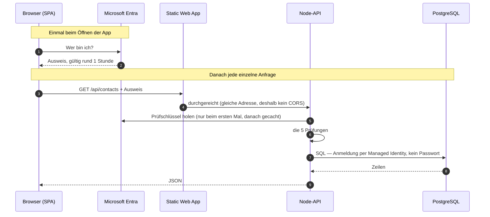

# Anmeldung & Absicherung

> Die Seite zum Einmal-Lesen, auch ohne Vorwissen. Danach sind
> [`verify.ts`](../apps/api/src/auth/verify.ts) und [`auth.ts`](../apps/web/src/data/adapters/azure/auth.ts)
> von oben bis unten lesbar — beide Dateien sind kommentarfrei und setzen genau das voraus, was hier steht.
>
> Gilt nur bei `platform: azure` in [`.unitix/project.json`](../.unitix/project.json). Im Mock-Prototyp ist
> [`initDataAccess()`](../apps/web/src/data/index.ts) ein No-op — es gibt keinen Login.

## Die Kurzfassung

Wer die App öffnet, wird zu Microsoft geschickt, dort geprüft und mit einem **unterschriebenen Ausweis**
(Token, gültig rund eine Stunde) zurückgeschickt. Die App hängt ihn an jede Anfrage an unsere API. Die API
prüft fünf Dinge — die rechte Spalte ist der Grund, warum keine wegfallen darf:

| # | Prüfung in [`verify.ts`](../apps/api/src/auth/verify.ts) | Ohne sie könnte … |
| --- | --- | --- |
| 1 | Unterschrift echt (`jwtVerify` gegen die JWKS des Mandanten) | … sich jeder einen Ausweis selbst schreiben |
| 2 | `iss` — von **unserem** Firmen-Microsoft ausgestellt | … ein Ausweis aus einem fremden Mandanten gelten |
| 3 | `aud` — für **unsere API** ausgestellt | … ein Ausweis für eine andere App hier gelten |
| 4 | `exp` — nicht abgelaufen (prüft `jose` selbst) | … ein abgegriffener Ausweis ewig gelten |
| 5 | `scp` enthält `access_as_user` | … ein reines „ist eingeloggt"-Token als „darf die API" durchgehen |

Stimmt eines nicht, antwortet die API `401` und macht sonst nichts. Einzige Ausnahme: `/health`, damit Azure
die Instanz prüfen kann. Mehr passiert in `verify.ts` nicht.

**Begriffe:** `iss` = wer hat ihn ausgestellt · `aud` = für wen · `exp` = wie lange gültig · `scp` = was darf
der Inhaber damit · `oid` = Personalnummer im Firmenverzeichnis (eindeutig und unveränderlich, anders als die
E-Mail) · **JWKS** = Microsofts öffentliche Schlüsselliste zum Prüfen der Unterschrift · **Entra ID** =
unser Firmenverzeichnis, früher „Azure AD" · **Managed Identity** = Ausweis für die *Maschine* statt für
einen Menschen; damit meldet sich die API an der Datenbank an, deshalb gibt es kein DB-Passwort
([`db/client.ts`](../apps/api/src/db/client.ts)).

## Der Ablauf

**Der Login läuft vor dem ersten Render.** [`main.tsx`](../apps/web/src/app/main.tsx) ruft `initDataAccess()`
und erst danach `createRoot()`. Ist niemand angemeldet, navigiert die Seite weg und React startet nie — es
gibt keinen Zustand „App läuft, aber ohne Ausweis", und keine Komponente muss sich mit Anmeldung befassen.

**Die API liegt unter derselben Adresse wie die App.** Lokal proxied Vite `/api` auf Port 3000, in Azure macht
die Static Web App dasselbe auf den App Service. Deshalb steht im Frontend nirgends eine Backend-URL, und
CORS greift im Normalbetrieb nie.

## Wo steht was

| Datei | Aufgabe |
| --- | --- |
| [`web/…/azure/auth.ts`](../apps/web/src/data/adapters/azure/auth.ts) | Ausweis **beschaffen** (Login, Erneuerung) |
| [`web/…/azure/client.ts`](../apps/web/src/data/adapters/azure/client.ts) | Ausweis an jede Anfrage **anhängen** |
| [`api/auth/verify.ts`](../apps/api/src/auth/verify.ts) | Ausweis **prüfen** |
| [`api/server.ts`](../apps/api/src/server.ts) | die Prüfung **erzwingen**, für jeden Endpunkt außer `/health` |
| [`api/env.ts`](../apps/api/src/env.ts) | die Werte, die „unser Mandant / unsere API" bedeuten |
| [`.unitix/project.json`](../.unitix/project.json) | `entra`-Block: dieselben Angaben für die SPA-Seite |

Das ist alles — keine weitere Stelle im Repo hat mit Anmeldung zu tun.

## Die vier Stellen in `auth.ts`, die nicht offensichtlich sind

Kurz, weil jede davon schon einmal einen Abend gekostet hat:

1. **Pflichtfeld-Prüfung zuerst.** Ein frischer Klon ohne ausgefüllten `entra`-Block würde sonst eine SPA
   bauen, die erst im Browser mit einer MSAL-Meldung scheitert. Deshalb `throw`, nicht `clientId: undefined`.
2. **Bei External ID trägt die Authority die Tenant-ID als Host**, nicht die Subdomain
   (`<tenantId>.ciamlogin.com/<tenantId>`) — Workaround für msal-browser #8592, sonst scheitert die
   Anmeldung mit `endpoints_resolution_error`. Nur in diesem Fall wird zusätzlich `knownAuthorities` gesetzt:
   `*.ciamlogin.com` ist für MSAL kein bekannter Microsoft-Host. Im Normalfall bewusst **nicht** — der
   Eintrag überspränge die Instance Discovery.
3. **`handleRedirectPromise()` läuft vor `getAllAccounts()` und vor dem ersten Render.** Entra antwortet per
   `response_mode=fragment` und teilt sich das URL-Fragment mit dem HashRouter; erst dieser Aufruf liest die
   Antwort und räumt das Fragment weg, sonst liest der Router sie als Route.
4. **`SILENT_DEAD_ENDS`** listet die MSAL-Fehlercodes, die nur interaktiv auflösbar sind, aber **keine**
   `InteractionRequiredAuthError` sind — `BrowserAuthError` und `InteractionRequiredAuthError` erben beide
   direkt von `AuthError`, ein `instanceof` erwischt sie nicht mit. Häufigster Fall ist `timed_out`: MSAL
   konnte das versteckte iframe nicht auslesen. Gegen eine Redirect-Schleife schützt MSAL selbst, es lehnt
   eine laufende Interaktion mit `interaction_in_progress` ab.

Der `entra`-Block trägt neben `tenantId`, `clientId` und `apiAudience` optional `subdomain`. Leer — der
Normalfall — heißt gewöhnlicher Firmen-Mandant; gesetzt wird es nur, wenn sich firmenfremde Personen selbst
registrieren sollen (Entra External ID, Anmeldung unter `*.ciamlogin.com`). Authority, Aussteller und
Schlüsselliste werden daraus gebildet, nie von Hand eingetragen:
[Optional: Entra External ID](azure-setup.md#optional-entra-external-id-statt-entra-id).

## ⚠️ Was *nicht* geprüft wird

> **Die API prüft, WER jemand ist — nicht, WAS er darf.**

Jeder angemeldete Mitarbeiter mit dem Scope `access_as_user` darf über die API **alles** lesen, anlegen,
ändern, löschen. Die geprüften Claims bleiben in [`server.ts`](../apps/api/src/server.ts);
[`handle.ts`](../apps/api/src/router/handle.ts) bekommt sie gar nicht — es gibt in der API keine Fachlogik,
die eine Identität bräuchte.

Der Rollen-Umschalter im UI ([`RoleContext.tsx`](../apps/web/src/shared/lib/role/RoleContext.tsx), `canSee` /
`canEdit`) ist **keine Sicherheitsgrenze**: `PROTOTYPE-ONLY`, vom Nutzer selbst umstellbar, existiert nur im
Browser. Er blendet Knöpfe aus, er verhindert keinen Request. Solange alle Nutzer intern sind und ohnehin
alles sehen dürfen, ist das in Ordnung. Sobald der erste Kunde sagt „Sachbearbeiter dürfen nicht löschen",
ist das ein Feature in der **API**: `claims` als Feld in [`RouterRequest`](../apps/api/src/router/handle.ts)
ergänzen und in `server.ts` durchreichen — drei Zeilen, bewusst nicht auf Vorrat da.

## Drosselung

Eine Bremse in [`server.ts`](../apps/api/src/server.ts): `RATE_LIMIT_MAX`, Default 200/min, **nach** der
Ausweisprüfung, Schlüssel ist die Personalnummer (`oid`) — nach Person, nicht nach Adresse, sonst würde ein
ganzes Kundennetz hinter einer NAT-Adresse gemeinsam ausgebremst. Wer zu schnell ist, bekommt `429` mit
`Retry-After`. Sie fängt die Endlosschleife im Client.

Bewusst **keine** zweite Bremse davor: die müsste nach Absender-Adresse zählen, und hinter dem
App-Service-Frontend ist die für alle Clients dieselbe — für einen brauchbaren Schlüssel müsste man
`X-Forwarded-For` selbst parsen (der App Service schreibt dort entgegen der Konvention einen Port mit).
Wenn ungedrosselte Anfragen ohne Token einmal wirklich weh tun, ist der richtige Ort davor — Azure Front
Door oder eine Conditional-Access-Policy —, nicht dieser Prozess.

**`/health` ist von der Bremse ausgenommen**, und zwar aus genau demselben Grund: ohne Token gibt es keine
Personalnummer, der Schlüssel fiele auf die Adresse zurück, und die ist für alle dieselbe. Alles, was von
aussen an `/health` geht, teilte sich damit einen Eimer — und darin sässe auch die Health-Check-Sonde von
Azure. Ihr `429` liest App Service als „Instanz ungesund" und startet neu: die Bremse wäre der Ausfall, den
sie verhindern soll. Der Endpunkt verträgt das, weil er nichts tut — kein Query, keine Prüfung, ein
statisches Objekt. Ohne die Ausnahme wäre er der einzige Pfad ohne Ausweis, auf den die Drosselung wirkt.

Aus demselben Gedanken protokolliert Fastify **nicht** jede Anfrage (`disableRequestLogging`): ungedrosselte
`401` würden sonst unbegrenzt Log schreiben — heute Plattenplatz, mit Application Insights eine Rechnung pro
GB. Was bleibt, ist der 500er-Log im Error-Handler und die Zeile aus der Tokenprüfung.

## Wenn der Login scheitert

Entra meldet Fehler als `AADSTS`-Nummer, in der Fehlerseite oder in der Browser-Konsole.

| Meldung | Ursache | Fix |
| --- | --- | --- |
| `AADSTS50011` — redirect URI mismatch | Deine Herkunfts-Adresse steht nicht in der SPA-Registrierung | URI in der **SPA**-Registrierung nachtragen, exakt inkl. Port, ohne Slash am Ende |
| `AADSTS9002326` — cross-origin token redemption | Plattform der SPA-Registrierung steht auf *Web* statt *Single-page application* | Plattform löschen und als *SPA* neu anlegen — umbenennen geht nicht |
| `AADSTS65001` — consent required | Die SPA hat keine Freigabe für den API-Scope | *API permissions* → `access_as_user` hinzufügen |
| `AADSTS700016` — application not found | Falsche `entra.clientId` oder falscher Mandant | Werte gegen die *Overview*-Seite der Registrierung prüfen |
| `AADSTS50058` — silent sign-in, no user signed in | Beim Erneuern gab es keine Sitzung mehr am Mandanten (abgelaufen, oder der Browser blockt den Cookie im iframe als Third-Party) | Für sich **kein** Fehler: MSAL wirft `InteractionRequiredAuthError`, `auth.ts` schickt in den Redirect-Flow. Bleibt die Seite hängen, fehlt `'self'` in `frame-src` |
| **401**, Login lief aber durch | App setting `ENTRA_API_AUDIENCE` passt nicht zu `entra.apiAudience` — die SPA fordert einen Scope für die eine App, die API erwartet die andere. Der häufigste Selbstschuss | Beide gegen die *Overview*-Seite der **API**-Registrierung prüfen ([Schritt 1](azure-setup.md)). Das Start-Log der API zeigt, mit welchen Werten sie läuft |
| **401**, `iss`-Fehler im Log | `requestedAccessTokenVersion` steht nicht auf `2` → Entra stellt Alt-Format-Token aus. Oder `ENTRA_SUBDOMAIN` falsch gesetzt (leer = Firmen-Mandant) | Manifest der **API**-Registrierung, Feld auf `2`, Save |
| Token ohne Scope `access_as_user` | Die SPA hat ein „ist eingeloggt"-Token statt eines „darf die API"-Tokens geholt | `entra.apiAudience` muss die **blanke Client-ID der API**-Registrierung sein (kein `api://…`, nicht die der SPA) — `auth.ts` baut den Scope daraus zusammen |
| **429** | Drosselung, siehe oben | Kein Fehler — Client-Schleife suchen |
| `endpoints_resolution_error` beim Start (nur External ID) | MSAL stolpert über den Host-Unterschied zwischen `iss` und Authority | Sollte nicht mehr auftreten, siehe Punkt 2 oben |
| `Refused to connect` / `Refused to frame` (CSP) | Eine Domain fehlt in der CSP | `connect-src` **und** `frame-src` in [`staticwebapp.config.json`](../apps/web/public/staticwebapp.config.json); `login.microsoftonline.com`, `*.ciamlogin.com` und `'self'` stehen bereits drin |
| `Framing '<eigene SWA-URL>' violates … frame-src` / `… frame-ancestors 'none'` | **Nicht** die Anmelde-Domain fehlt, sondern die **eigene**: die stille Erneuerung endet mit einem Redirect auf die `redirectUri`, also zurück in die eigene Origin, im iframe. `frame-src` erlaubt dem **Elterndokument** das Einbetten, `frame-ancestors` dem **eingebetteten** Dokument, eingebettet zu werden — beide Hälften müssen sitzen | `'self'` in `frame-src` **und** `frame-ancestors 'self'` statt `'none'`. Der Clickjacking-Schutz bleibt: fremde Origins sind weiter ausgeschlossen |
| `timed_out` (`monitor_window_timeout`), keine CSP-Meldung mehr | Die App startet im Erneuerungs-iframe mit (es zeigt auf die `redirectUri`, also auf die App selbst); ein zweites MSAL greift auf denselben `sessionStorage` zu und verbraucht die Antwort vor dem Elternfenster | [`main.tsx`](../apps/web/src/app/main.tsx) startet die App nicht in einem iframe mit Auth-Fragment. Typisch, wenn man „noch angemeldet" ist: Konto im Cache, Refresh-Token abgelaufen (SPA: ~24 h) |

Zwei Dinge, die man beim Ändern wissen muss: den `entra`-Block in `.unitix/project.json` backt Vite ins
Bundle — er wirkt für die **SPA** erst nach Rebuild + Redeploy und für die **API** in Azure gar nicht (dort
zählen die App settings; lokal liest sie die Datei direkt). Und ein Endpunkt, den man in `server.ts` zu
`isPublic` hinzufügt, ist ab sofort **ohne jede Anmeldung** aus dem Internet erreichbar.

Schnellste Gesamtprüfung ist der letzte Punkt des [Smoke-Tests](azure-setup.md#7-smoke-test):
`https://<web-app>.azurewebsites.net/api/contacts` ohne Ausweis muss **401** liefern.

## Entschieden und abgehakt

**`jose` statt eines Microsoft-Packages** — es gibt keines mehr: `passport-azure-ad` ist eingestellt und
archiviert, Microsofts eigene Node-Beispiele prüfen genauso selbst. Der schwierige Teil (Schlüssel holen,
cachen, rotieren, Signatur rechnen) steckt in `jose`; was in `verify.ts` bleibt, enthält **keine**
Kryptographie, sondern drei Projektwerte: welcher Mandant, welche API, welcher Scope.

**Kein App Service „Easy Auth"** — es verlagert die Prüfung, schafft sie nicht ab: dieselben Begriffe
stünden im Portal statt in git. Dazu bräuchte es einen Umgehungspfad für die lokale Entwicklung (Easy Auth
existiert auf `localhost` nicht), dessen Fehlermodus „Anmeldung in Produktion aus" wäre. Und die SPA bräuchte
MSAL trotzdem, weil Easy Auth nur prüft und nichts beschafft.

**Kein `@azure/msal-react`** — es ersetzt keine Zeile, es legt eine React-Schicht darüber. Sinnvoll, wenn
Anmeldung ein *darstellbarer Zustand* ist (Login-Knopf, mehrere Konten); hier ist der Login vor dem ersten
Render fertig. Ein `MsalProvider` in `App.tsx` würde den Komponentenbaum backend-abhängig machen und damit
die Regel brechen, dass `mock → azure` ein Ein-Datei-Tausch in [`data/index.ts`](../apps/web/src/data/index.ts)
ist. Wird später ein „angemeldet als …" im Header gebraucht, reichen zwei Exports aus `auth.ts`.
