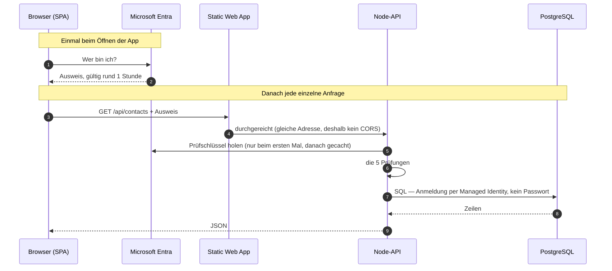

# Anmeldung & Absicherung — die Seite zum Einmal-Lesen

> Für alle im Team, auch ohne Vorwissen. Wer diese Seite gelesen hat, kann
> [`verify.ts`](../apps/api/src/auth/verify.ts) und [`auth.ts`](../apps/web/src/data/adapters/azure/auth.ts)
> von oben bis unten lesen — die Kommentare dort setzen genau das voraus, was hier steht.
>
> Gilt nur bei `backend: azure` in [`.unitix/project.json`](../.unitix/project.json). Der
> Mock-Prototyp hat keinen Login: [`initDataAccess()`](../apps/web/src/data/index.ts) ist dort ein No-op.

## Die Kurzfassung

Wenn jemand die App öffnet, schickt der Browser ihn zu Microsoft. Microsoft prüft, wer er ist, und
schickt ihn mit einem **unterschriebenen Ausweis** zurück. Die App hängt diesen Ausweis an jede
Anfrage an unsere API. Die API prüft am Ausweis fünf Dinge:

1. Ist die **Unterschrift echt** — kommt der Ausweis wirklich von Microsoft?
2. Ist er von **unserem** Firmen-Microsoft ausgestellt und nicht von einem fremden?
3. Ist er für **unsere API** ausgestellt und nicht für eine andere Anwendung?
4. Ist er noch **gültig** oder abgelaufen?
5. Steht drauf, dass der Inhaber **diese API benutzen darf**?

Stimmt eines davon nicht, antwortet die API mit „401 — nein" und macht sonst nichts. Einzige
Ausnahme ist `/health`, damit Azure prüfen kann, ob der Server überhaupt läuft.

Das ist der vollständige Inhalt der rund 45 Zeilen in `verify.ts`. Mehr passiert dort nicht.

## Die sieben Wörter

Einmal lesen, danach ist der Code lesbar:

| Wort im Code | Heißt schlicht |
| --- | --- |
| **Token** | der Ausweis |
| **`iss`** (Issuer) | wer hat ihn ausgestellt |
| **`aud`** (Audience) | für wen ist er ausgestellt |
| **`exp`** (Expiry) | wie lange gilt er (rund eine Stunde) |
| **`scp`** (Scope) | was darf der Inhaber damit |
| **`oid`** (Object ID) | die Personalnummer im Firmenverzeichnis — eindeutig und unveränderlich, anders als die E-Mail |
| **JWKS** | Microsofts öffentliche Liste, mit der man Unterschriften prüfen kann |

Zwei weitere Namen, die ständig fallen:

- **Entra ID** — der frühere Name war „Azure AD". Unser Firmenverzeichnis: wer arbeitet hier, wer darf was.
- **Managed Identity** — ein Ausweis für die *Maschine* statt für einen Menschen. Damit meldet sich
  die API bei der Datenbank an, deshalb gibt es kein Datenbank-Passwort. Siehe [`db/client.ts`](../apps/api/src/db/client.ts).

## Der Ablauf

Zwei Dinge daran sind bewusst so gebaut und erklären viel:

**Der Login läuft vor dem ersten Render.** [`main.tsx`](../apps/web/src/app/main.tsx) ruft
`initDataAccess()` und erst danach `createRoot()`. Ist niemand angemeldet, navigiert die Seite weg
und React startet nie. Dadurch gibt es keinen Zustand „App läuft, aber ohne Ausweis" — und keine
einzige Komponente muss sich mit Anmeldung befassen.

**Die API liegt unter derselben Adresse wie die App.** Lokal proxied Vite `/api` auf Port 3000, in
Azure macht die Static Web App dasselbe auf den App Service. Deshalb steht im Frontend nirgends eine
Backend-URL, und CORS greift im Normalbetrieb nie.

## Wo steht was

| Datei | Aufgabe | Zeilen |
| --- | --- | --- |
| [`web/…/azure/auth.ts`](../apps/web/src/data/adapters/azure/auth.ts) | Ausweis **beschaffen** (Login, Erneuerung) | ~35 |
| [`web/…/azure/client.ts`](../apps/web/src/data/adapters/azure/client.ts) | Ausweis an jede Anfrage **anhängen** | ~40 |
| [`api/auth/verify.ts`](../apps/api/src/auth/verify.ts) | Ausweis **prüfen** | ~45 |
| [`api/server.ts`](../apps/api/src/server.ts) | die Prüfung **erzwingen**, für jeden Endpunkt außer `/health` | ~30 |
| [`api/env.ts`](../apps/api/src/env.ts) | die Werte, die „unser Mandant / unsere API" bedeuten | — |
| [`.unitix/project.json`](../.unitix/project.json) | `entra`-Block: dieselbe Angabe für die SPA-Seite | — |

Der `entra`-Block trägt neben `tenantId`, `clientId` und `apiAudience` optional das Feld `subdomain`.
Bleibt es leer — der Normalfall —,
ist der Mandant ein gewöhnlicher Firmen-Mandant. Gesetzt wird es nur, wenn sich firmenfremde Personen
selbst registrieren sollen: dann liefert Microsoft dieselbe Anmeldung unter anderen Adressen aus
(`*.ciamlogin.com`) — Authority, Aussteller und Schlüssel-Liste werden aus der Subdomain automatisch
gebildet, nicht von Hand eingetragen. Anleitung: [Optional: Entra External ID](azure-setup.md#optional-entra-external-id-statt-entra-id).

Das ist alles. Es gibt keine weitere Stelle im Repo, die mit Anmeldung zu tun hat.

## Die fünf Prüfungen im Code

Alle in [`verify.ts`](../apps/api/src/auth/verify.ts). Die Spalte rechts ist der Grund, warum keine
davon wegfallen darf:

| Prüfung | Wo | Ohne sie könnte … |
| --- | --- | --- |
| Unterschrift | `jwtVerify(token, keySet(), …)` | … sich jeder einen Ausweis selbst schreiben |
| `iss` (Aussteller) | `issuer:` in derselben Zeile | … ein Ausweis aus einem **fremden Firmen-Microsoft** gelten |
| `aud` (Empfänger) | `audience:` in derselben Zeile | … ein Ausweis für eine **andere App** hier gelten |
| `exp` (Ablauf) | prüft `jose` automatisch | … ein einmal abgegriffener Ausweis ewig gelten |
| `scp` (Berechtigung) | `toClaims()`, oberer Block | … ein reiner „ist eingeloggt"-Ausweis als „darf die API benutzen" durchgehen |

Die Werte, die „unser Mandant, unsere API" bedeuten, stehen im `entra`-Block von
[`.unitix/project.json`](../.unitix/project.json) und kommen aus den zwei App-Registrierungen —
angelegt in [Schritt 1 des Azure-Setups](azure-setup.md). In Azure heißen sie als App settings
genauso, nur in SCREAMING_SNAKE (`tenantId` → `ENTRA_TENANT_ID`); die Datei wird dorthin **nicht**
mitdeployed.

## ⚠️ Was *nicht* geprüft wird

Das ist der Teil, den man am leichtesten falsch versteht:

> **Die API prüft, WER jemand ist — nicht, WAS er darf.**

Jeder angemeldete Mitarbeiter mit dem Scope `access_as_user` darf über die API **alles**: alle
Kontakte und Firmen lesen, anlegen, ändern, löschen. Die geprüften Claims bleiben in
[`server.ts`](../apps/api/src/server.ts); [`handle.ts`](../apps/api/src/router/handle.ts) bekommt
sie gar nicht — es gibt in der API keine Fachlogik, die eine Identität bräuchte.

Der Rollen-Umschalter im UI ([`RoleContext.tsx`](../apps/web/src/shared/lib/role/RoleContext.tsx),
`canSee` / `canEdit`) ist **keine Sicherheitsgrenze**. Er ist als `PROTOTYPE-ONLY` markiert, der
Nutzer stellt ihn selbst um, und er existiert nur im Browser. Er blendet Knöpfe aus — er verhindert
keinen einzigen Request.

**Praktisch heißt das:** Solange alle Nutzer intern sind und ohnehin alles sehen dürfen, ist das in
Ordnung. Sobald der erste Kunde sagt „Sachbearbeiter dürfen nicht löschen", ist das ein Feature in
der **API**, nicht im UI — und dann wird `claims` als Feld in
[`RouterRequest`](../apps/api/src/router/handle.ts) ergänzt und in `server.ts` durchgereicht. Das
ist ein Drei-Zeilen-Schritt und steht bewusst nicht auf Vorrat da.

## Was passiert, wenn du … änderst

| Änderung | Folge |
| --- | --- |
| `ENTRA_API_AUDIENCE` in den App Settings | **Sofort jeder Request 401.** Der häufigste Selbstschuss. |
| `ENTRA_SUBDOMAIN` | Leer = Firmen-Mandant. Aussteller und Schlüssel-Liste werden daraus automatisch gebildet — ein falscher Wert → **jeder Request 401**, obwohl der Login durchläuft. |
| eine neue Redirect-URI (neue Domain, Testumgebung) | Login scheitert mit `AADSTS50011`, bis die URI **auch** in der SPA-Registrierung steht |
| den `entra`-Block in `.unitix/project.json` | Wirkt für die **SPA** erst nach Rebuild + Redeploy (Vite backt die Werte ins JS) und für die **API** in Azure gar nicht — dort zählen die App settings. Lokal wirkt es sofort. |
| einen Endpunkt zu `isPublic` in `server.ts` hinzugefügt | Er ist ab sofort **ohne jede Anmeldung** aus dem Internet erreichbar |
| `RATE_LIMIT_MAX` | siehe [Drosselung](#drosselung) |
| eine neue Tabelle in `registry.ts` | Nichts an der Anmeldung — sie ist automatisch genauso geschützt wie die anderen |

## Drosselung

Eine Bremse, in [`server.ts`](../apps/api/src/server.ts):

| | Wann | Schlüssel | Default | Wogegen |
| --- | --- | --- | --- | --- |
| `RATE_LIMIT_MAX` | **nach** der Ausweisprüfung | Personalnummer (`oid`) | 200/min | Eine Endlosschleife im Client. Nach Person, nicht nach Adresse — sonst würde ein ganzes Kundennetz hinter einer NAT-Adresse gemeinsam ausgebremst. |

Wer zu schnell ist, bekommt `429` mit einem `Retry-After`-Header.

Bewusst **keine** zweite Bremse vor der Ausweisprüfung: die würde nach Absender-Adresse zählen, und
hinter dem App-Service-Frontend ist die für alle Clients dieselbe — für einen brauchbaren Schlüssel
müsste man `X-Forwarded-For` selbst parsen (der App Service schreibt dort entgegen der Konvention
einen Port mit). Das ist Aufwand und eine Fehlerquelle für eine Anwendung, die nur angemeldete
Mitarbeiter erreichen. Wenn ungedrosselte Anfragen ohne Token einmal wirklich weh tun, ist der
richtige Ort davor — Azure Front Door oder eine Conditional-Access-Policy —, nicht dieser Prozess.

## Wenn der Login scheitert

Entra meldet Fehler als `AADSTS`-Nummer — in der Fehlerseite oder in der Browser-Konsole.

| Meldung | Ursache | Fix |
| --- | --- | --- |
| `AADSTS50011` — redirect URI mismatch | Die Adresse, von der du kommst, steht nicht in der SPA-Registrierung | URI in der **SPA**-Registrierung nachtragen, exakt inkl. Port, ohne Slash am Ende |
| `AADSTS9002326` — cross-origin token redemption | Die Plattform der SPA-Registrierung steht auf *Web* statt *Single-page application* | Plattform löschen und als *SPA* neu anlegen — umbenennen geht nicht |
| `AADSTS65001` — consent required | Die SPA hat keine Freigabe für den API-Scope | *API permissions* → `access_as_user` hinzufügen |
| `AADSTS700016` — application not found | Falsche `entra.clientId`, oder falscher Mandant | Werte gegen die *Overview*-Seite der Registrierung prüfen |
| API antwortet **401**, Login lief aber durch | Das App setting `ENTRA_API_AUDIENCE` in Azure passt nicht zu `entra.apiAudience` in `project.json` — die SPA fordert einen Scope für die eine, die API erwartet die andere App | Beide gegen die *Overview*-Seite der **API**-Registrierung prüfen ([Schritt 1](azure-setup.md)). Das Start-Log der API zeigt, mit welchen Werten sie tatsächlich läuft |
| API antwortet **401**, `iss`-Fehler im Log | `requestedAccessTokenVersion` steht nicht auf `2` → Microsoft schickt Alt-Format-Ausweise | Manifest der **API**-Registrierung, Feld auf `2`, Save |
| Token ohne Scope `access_as_user` | Die SPA hat ein „ist eingeloggt"-Token statt eines „darf die API"-Tokens geholt | `entra.apiAudience` muss die **blanke Client-ID der API**-Registrierung sein (kein `api://…`, nicht die der SPA). Den Scope baut [`auth.ts`](../apps/web/src/data/adapters/azure/auth.ts) daraus zusammen — steht dort die falsche id, fragt die SPA einen Scope an, den es nicht gibt |
| API antwortet **429** | Drosselung, siehe oben | Kein Fehler — Client-Schleife suchen |
| `endpoints_resolution_error` beim Start (nur External ID) | MSAL prüft den gemeldeten `iss` gegen die Authority und stolpert über einen Host-Unterschied | Sollte nicht mehr auftreten — `auth.ts` verwendet dafür automatisch die Tenant-ID als Host, siehe [azure-setup.md](azure-setup.md#optional-entra-external-id-statt-entra-id) |
| Konsole meldet `Refused to connect`/`Refused to frame` (CSP) | Die Anmelde-Domain fehlt in der CSP | `connect-src` **und** `frame-src` in [`staticwebapp.config.json`](../apps/web/public/staticwebapp.config.json); `login.microsoftonline.com` und `*.ciamlogin.com` stehen bereits drin |

Der letzte Punkt aus dem [Smoke-Test](azure-setup.md#7-smoke-test) ist die schnellste Gesamtprüfung:
`https://<web-app>.azurewebsites.net/api/contacts` ohne Ausweis muss **401** liefern. Kommt dort
etwas anderes, ist die Absicherung offen.

## Entschieden und abgehakt

Damit diese Fragen nicht alle sechs Monate neu aufgemacht werden:

**Warum `jose` und nicht ein Microsoft-Package?** Weil es keines mehr gibt — Microsofts frühere
Node-Bibliothek `passport-azure-ad` ist eingestellt und archiviert, und Microsofts eigene aktuellen
Node-Beispiele prüfen den Ausweis genauso selbst. Der schwierige Teil (Schlüssel holen, cachen,
rotieren, Signatur rechnen) steckt bereits vollständig in `jose`. Was in `verify.ts` übrig bleibt,
enthält **keine Kryptographie** — es sind drei Projektwerte: welcher Mandant, welche API, welcher
Scope. Die kann kein Package für uns wissen.

**Warum nicht App Service „Easy Auth"?** Es würde die Prüfung in die Plattform verlagern, aber
nicht abschaffen: dieselben Begriffe (`iss`, `aud`) stünden dann im Azure-Portal statt in einer
Datei — nicht in git, nicht im Review, nicht durchsuchbar. Dazu bräuchte es einen Umgehungspfad für
die lokale Entwicklung, weil Easy Auth auf `localhost` nicht existiert; dessen Fehlermodus wäre
„Anmeldung in Produktion aus". Unterm Strich mehr Code als vorher, an einem schlechter
einsehbaren Ort. Und die SPA bräuchte MSAL trotzdem, weil Easy Auth nur prüft und nichts beschafft.

**Warum nicht `@azure/msal-react`?** Es ersetzt keine Zeile, es legt eine React-Schicht darüber —
sinnvoll, wenn Anmeldung ein *darstellbarer Zustand* ist (Login-Knopf, mehrere Konten). Hier ist sie
das nicht: der Login ist vor dem ersten Render fertig. Ein `MsalProvider` in `App.tsx` würde
außerdem den Komponentenbaum backend-abhängig machen — und damit die Regel brechen, dass der
Wechsel `mock → azure` ein Ein-Datei-Tausch in [`data/index.ts`](../apps/web/src/data/index.ts) ist.
Wird später ein „angemeldet als …" im Header gebraucht, reichen zwei Exports aus `auth.ts`.
